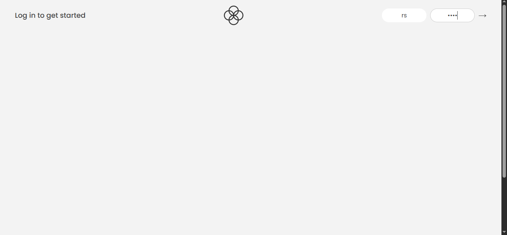
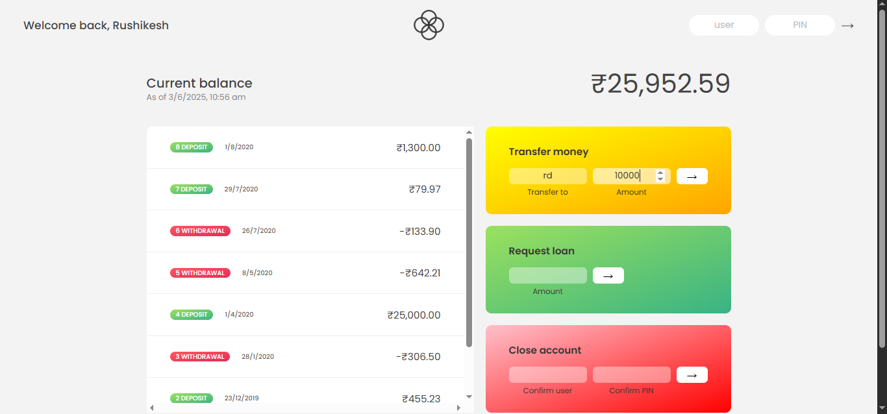
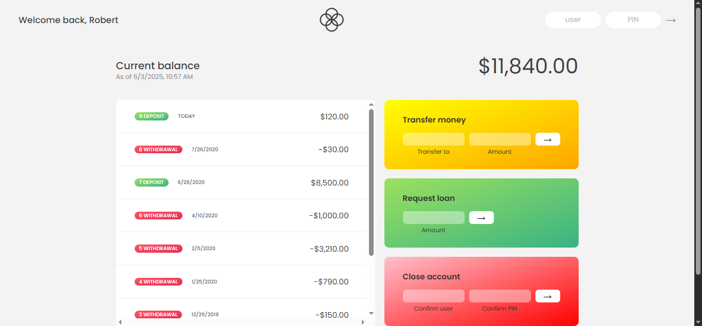
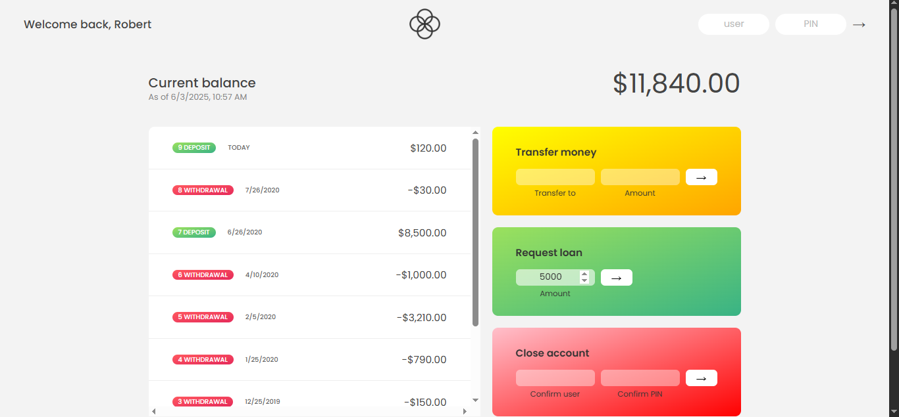
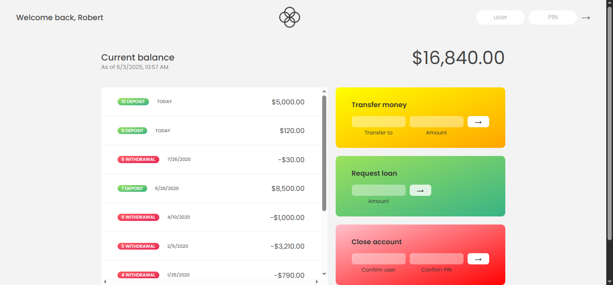

# 🏦 Bankist App
A modern banking web application built using **HTML, CSS, and JavaScript**, inspired by real-world banking platforms.

This project simulates a bank interface with secure login, transaction summaries, and live features.

> 🎓 This project is part of Jonas Schmedtmann's JavaScript course on [jonas.io](https://jonas.io).
## ✨ Features

- ✅ User Login (2 demo accounts)
- 💰 View full account summary
  - Total Income
  - Total Outgoing
  - Interest Earned
- 🔄 Money Transfer (between accounts)
- 🌍 Currency conversion (INR ↔ USD) with live exchange rate logic
- 🧾 Loan requests and credits
- ❌ Close Account securely
- ⏱️ Auto-logout after 5 minutes of inactivity (session timer)
## 🖼️ Screenshots

### 🔹 Login Page

### 🔹 Dashboard View

### 🔹 Transfer Money

### 🔹 Received Money

### 🔹 Loan Request

### 🔹 Loan Approved

## 🚀 How to Run the Project

- Clone or download the repository
- Open index.html in any modern web browser.   ## 🧪 Test Credentials

You can use these demo accounts:

- 👤 Account 1 (INR)
  - Username: `rs`
  - PIN: `1111`

- 👤 Account 2 (USD)
  - Username: `rd`
  - PIN: `2222`
## 🛠️ Technologies Used

- 🧱 HTML5
- 🎨 CSS3
- ⚙️ JavaScript
